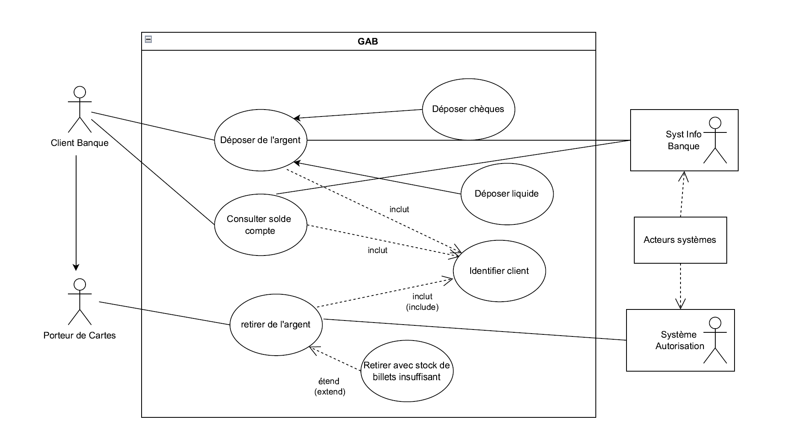

# UML LUNDI 10h00 - 12h00

# Polycopier

## Chapitre 2: Les Diagrammes de Cas d’Utilisation

[UML用例图（Use Case Diagram）概述](https://zhuanlan.zhihu.com/p/135348779)

### Définition: Objectif ou service que le systèmes doit remplir, motivé par un besoin d’un ou plusieurs acteurs.

### Difficultés:

1. Définir de quoi les utilisateurs ont vraiment besoin:
    1. Poser le bon problème.
    2. Ne pas laisser les utilisateurs se mêler de réalisation.
    3. Ne pas inventer des fonctions pour le plaisir.
2. Bannir toute considération de réalisation lors des premières rencontres.
3. Comprendre le besoin de manière globale:
    1. Flot incommensurable d’informations (Il faut que..).
    2. Contradictions entre les utilisateurs.
4. Besoins mouvants…

### 要点总结：

用例相互之间有三种关系： 扩展， 包含和继承。

1. 扩展：（extends）拓展出来的特殊情况 
2. 包含：（inlcudes）情况中的一种子情况
3. 继承：（黑色实心箭头）是其中的一种

参与者与用例之间使用没有箭头的实线连接。

## Chapitre 3: Les Diagrammes de Classes

### Diagrammes de classe

[保姆级教程--类图怎么画_码龄时长两年半的博客-CSDN博客_类图怎么画](https://blog.csdn.net/q584401071/article/details/122201102)

‘+’ public

‘-’ private

‘#’ protected

不带符号为 default

依赖：（虚线+箭头）

关联：（）

聚合：

弱聚合：（实线+空心菱形）并不是老师走了学校就干不下去了

强聚合：（实线+实心菱形）两者并不能脱离开

实现和泛化：

实现：实线 指向大的

### Classes d’analyse

### Classe Techniques niveau conception

### Diagrammes d’objets *

## Chapitre 4: Les Diagrammes de Paquet

横线 → 关联 

横线+实心菱形 → 组成

应该表明数量

关联关系应该标明是什么关系

[UML图详解（九）包图_FXBStudy的博客-CSDN博客_包图之间的关系](https://blog.csdn.net/fanxiaobin577328725/article/details/51700528)

所含元素：

类，接口，组件，节点，协作，用例，图以及其他包

依赖关系：

使用虚线开放箭头表示

《import》： 客户包中的元素能够访问提供者中的所有元素

《access》 ： 只想使用提供者包中的元素，而不想将其命名空间合并

## Chapitre 5: Les Diagrammes d’Etats

[图文案例并举，最全UML状态图详解_swordking1983的技术博客_51CTO博客](https://blog.51cto.com/u_2702712/2350266)

历史状态：记住从组合状态中退出时所处的子状态，当再次进入组合时直接进入子状态。

并发区域：标明组合状态在某一时刻可以同时达到多个子状态。

## Chapitre 6: Les Diagrammes de Séquences

[UML 序列图详解-UML](http://www.uml.org.cn/oobject/201909232.asp)

# Travaux Dirigés

## TD 1: UML-CAS D’UTILISATION

## TD 2: UML-CLASSES

### PB1

### PB1V2

### PB2

### PB2V2

## TD 3: UML-ETATS TRANSITIONS

### PB1Q1

### PB1Q2

### PB2

## TD 4: DIAGRAMMES DE SEQUENCES